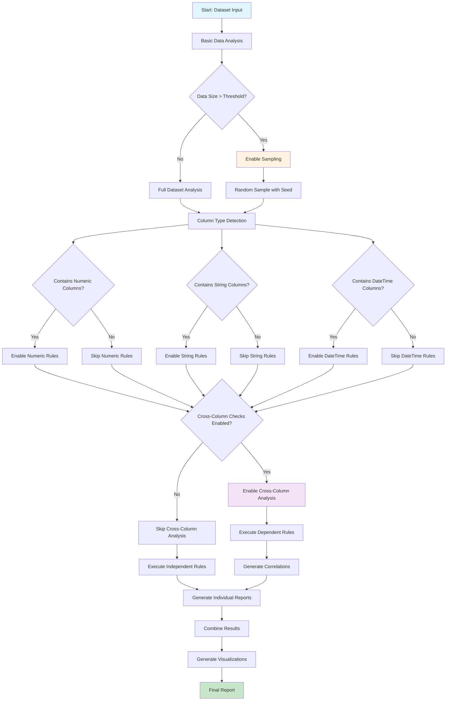

# Product Requirements Document (PRD)
## Python Code Generation System for Vebo Data Profiling Checks

### Document Information
- **Version**: 1.0
- **Date**: December 2024
- **Author**: AI Assistant
- **Status**: Draft

---

## 1. Executive Summary

### 1.1 Purpose
This PRD outlines the requirements for developing a Python code generation system that automatically creates data profiling checks based on the extensive rules directory in the Vebo project. The system will transform rule definitions into executable Python code for data quality assessment and profiling.

### 1.2 Background
Vebo is a data profiling tool that automatically profiles tabular datasets to provide insights into data structure and quality. The project contains over 1,000 rule files across multiple programming languages and frameworks, representing a comprehensive knowledge base of coding standards, best practices, and validation rules.

### 1.3 Goals
- Automate the generation of Python code for data profiling checks
- Leverage the existing rules directory as a knowledge base
- Create a scalable, maintainable system for rule-to-code transformation
- Support both basic and advanced profiling checks
- Enable extensibility for new rule types and languages

---

## 2. Product Overview

### 2.1 Product Vision
A comprehensive Python code generation system that transforms structured rules into executable data profiling checks, enabling automated data quality assessment and insights generation.

### 2.2 Target Users
- **Primary**: Data engineers and analysts using Vebo for data profiling
- **Secondary**: Developers extending the Vebo platform
- **Tertiary**: Data quality teams implementing automated checks

### 2.3 Success Metrics
- **Code Generation Accuracy**: >95% of generated code executes without syntax errors
- **Rule Coverage**: Support for 80%+ of existing rule types
- **Performance**: Generate checks for datasets up to 10GB within 5 minutes
- **Extensibility**: Support for adding new rule types within 1 day

---

## 3. Functional Requirements

### 3.1 Core Features

#### 3.1.1 Rule Parser and Analyzer
- **REQ-001**: Parse `.mdc` rule files and extract checkable criteria
- **REQ-002**: Identify rule categories (code style, data validation, performance, security)
- **REQ-003**: Extract parameters, conditions, and expected outcomes from rules
- **REQ-004**: Handle nested rules and rule dependencies

#### 3.1.2 Python Code Generator
- **REQ-005**: Generate Python functions for individual checks
- **REQ-006**: Create test cases for generated checks
- **REQ-007**: Generate configuration files for check parameters
- **REQ-008**: Support both basic and advanced check types

#### 3.1.3 Check Execution Engine
- **REQ-009**: Execute generated checks against datasets
- **REQ-010**: Support sampling for large datasets
- **REQ-011**: Provide detailed reporting of check results
- **REQ-012**: Handle errors gracefully with informative messages

#### 3.1.4 Integration Layer
- **REQ-013**: Integrate with existing Vebo web interface
- **REQ-014**: Support batch processing of multiple datasets
- **REQ-015**: Provide API endpoints for check execution
- **REQ-016**: Export results in multiple formats (JSON, CSV, HTML)

### 3.2 Advanced Features

#### 3.2.1 Rule Customization
- **REQ-017**: Allow users to modify rule parameters
- **REQ-018**: Support custom rule creation
- **REQ-019**: Enable rule versioning and history

#### 3.2.2 Performance Optimization
- **REQ-020**: Implement parallel check execution
- **REQ-021**: Support incremental checking for large datasets
- **REQ-022**: Cache frequently used checks

#### 3.2.3 Extensibility
- **REQ-023**: Plugin architecture for custom check types
- **REQ-024**: Support for additional programming languages
- **REQ-025**: Integration with external validation libraries

---

## 4. Technical Requirements

### 4.1 Architecture

#### 4.1.1 System Components
```
┌─────────────────┐    ┌──────────────────┐    ┌─────────────────┐
│   Rule Parser   │───▶│  Code Generator  │───▶│ Check Executor  │
└─────────────────┘    └──────────────────┘    └─────────────────┘
         │                       │                       │
         ▼                       ▼                       ▼
┌─────────────────┐    ┌──────────────────┐    ┌─────────────────┐
│  Rule Database  │    │  Generated Code  │    │  Results Store  │
└─────────────────┘    └──────────────────┘    └─────────────────┘
```

#### 4.1.2 Technology Stack
- **Backend**: Python 3.11+
- **Web Framework**: FastAPI (existing)
- **Data Processing**: pandas, numpy, csv module
- **Database**: SQLite for rule storage and metadata
- **Code Generation**: AST manipulation, Jinja2 templates
- **Parallelization**: concurrent.futures, multiprocessing
- **Testing**: pytest, pytest-cov
- **Documentation**: Sphinx, mkdocs

### 4.2 Data Models

#### 4.2.1 Rule Model
```python
@dataclass
class Rule:
    id: str
    name: str
    description: str
    category: str
    language: str
    globs: List[str]
    always_apply: bool
    content: str
    parameters: Dict[str, Any]
    dependencies: List[str]
    created_at: datetime
    updated_at: datetime
```

#### 4.2.2 Check Model
```python
@dataclass
class Check:
    id: str
    rule_id: str
    name: str
    function_name: str
    parameters: Dict[str, Any]
    generated_code: str
    test_code: str
    status: CheckStatus
    created_at: datetime
```

#### 4.2.3 Execution Result Model
```python
@dataclass
class CheckResult:
    check_id: str
    dataset_id: str
    status: CheckStatus
    message: str
    details: Dict[str, Any]
    execution_time: float
    timestamp: datetime
```

### 4.3 API Design

#### 4.3.1 Core Endpoints
- `POST /api/v1/rules/parse` - Parse rule files
- `POST /api/v1/checks/generate` - Generate checks from rules
- `POST /api/v1/checks/execute` - Execute checks on dataset
- `GET /api/v1/checks/{id}/results` - Get check results
- `GET /api/v1/rules/categories` - List rule categories

#### 4.3.2 WebSocket Endpoints
- `/ws/checks/progress` - Real-time check execution progress
- `/ws/rules/updates` - Rule file change notifications

---

## 5. Implementation Plan

### 5.1 Phase 1: Foundation (Weeks 1-4)
- [ ] Set up project structure and dependencies
- [ ] Implement basic rule parser for `.mdc` files
- [ ] Create core data models
- [ ] Develop basic code generation templates
- [ ] Implement unit tests

### 5.2 Phase 2: Core Features (Weeks 5-8)
- [ ] Complete rule parser with category detection
- [ ] Implement Python code generator
- [ ] Create check execution engine
- [ ] Develop basic web interface integration
- [ ] Add comprehensive testing

### 5.3 Phase 3: Advanced Features (Weeks 9-12)
- [ ] Implement performance optimizations
- [ ] Add rule customization features
- [ ] Create plugin architecture
- [ ] Develop advanced reporting
- [ ] Add documentation and examples

### 5.4 Phase 4: Production Ready (Weeks 13-16)
- [ ] Performance testing and optimization
- [ ] Security audit and hardening
- [ ] User acceptance testing
- [ ] Deployment and monitoring setup
- [ ] Training materials and documentation

---

## 6. Risk Assessment

### 6.1 Technical Risks
- **Risk**: Complex rule parsing may be error-prone
  - **Mitigation**: Comprehensive testing and validation
- **Risk**: Generated code may have security vulnerabilities
  - **Mitigation**: Code review, static analysis, sandboxing
- **Risk**: Performance issues with large datasets
  - **Mitigation**: Sampling, parallel processing, caching

### 6.2 Business Risks
- **Risk**: User adoption may be slow
  - **Mitigation**: User feedback, iterative improvements
- **Risk**: Maintenance overhead for generated code
  - **Mitigation**: Automated testing, version control

---

## 7. Success Criteria

### 7.1 Functional Success
- [ ] Successfully parse 80%+ of existing rule files
- [ ] Generate executable Python code for all supported rule types
- [ ] Execute checks on datasets up to 10GB
- [ ] Provide accurate and actionable results

### 7.2 Technical Success
- [ ] Code generation time < 30 seconds per rule
- [ ] Check execution time < 5 minutes for 10GB dataset
- [ ] System uptime > 99.5%
- [ ] Zero critical security vulnerabilities

### 7.3 User Success
- [ ] User satisfaction score > 4.0/5.0
- [ ] 90%+ of generated checks execute successfully
- [ ] Average time to generate first check < 10 minutes
- [ ] Support for 5+ different rule categories

---

## 8. Clarifications and Requirements (Updated)

### 8.1 Clarified Requirements
Based on stakeholder input, the following requirements have been clarified:

1. **Rule Processing Strategy**: Focus first on rules that can determine which other rules are relevant (meta-rules for rule selection)
2. **Python Libraries**: Use pandas as main library, numpy for numeric aggregations, plus other relevant libraries as needed
3. **User Workflow**: Users input a dataframe and optional flags to enable/disable rule categories. The rule-running funnel is fully automatic.
4. **Performance Requirements**: Few seconds for smaller dataframes, few minutes for large ones
5. **Integration**: This will be part of the main Vebo application
6. **Rule Categories**: Prioritize meta-rules that determine rule relevance (see #1)
7. **Custom Rules**: High-level enable/disable flags only. All other decisions inferred from data
8. **Data Sources**: CSV format for initial implementation
9. **Error Handling**: High level of detail, but errors should skip specific checks/groups rather than stop entire run
10. **Deployment**: Local "small" machines with basic parallelization

### 8.2 Final Clarifications (Updated)
Based on additional stakeholder input:

1. **Rule Selection Logic**: Meta-rules should use data types, data patterns, size thresholds, and any other relevant selection criteria (excluding column names)
2. **Rule Categories**: Focus on "deepness level" - users can disable cross-column checks for faster, more concise reports
3. **Output Format**: JSON schema with support for images and visualizations (see Section 9.3)
4. **Rule Dependencies**: Decision tree/graph approach for handling rule dependencies (see Section 9.4)
5. **Sampling Strategy**: Random sampling with constant seed for reproducibility
6. **Parallelization**: Both rule-level and category-level parallelization

---

## 9. Appendices

### 9.1 Glossary
- **Rule**: A structured definition of a coding standard, best practice, or validation criterion
- **Check**: An executable piece of code generated from a rule
- **Profiling**: The process of analyzing data to understand its structure and quality
- **MDC**: Markdown with metadata format used for rule definitions
- **Meta-rule**: A rule that determines which other rules are relevant based on data characteristics
- **Deepness Level**: The extent of analysis depth, controlled by enabling/disabling cross-column checks

### 9.2 References
- Existing Vebo project documentation
- Rules directory structure and examples
- Python best practices and coding standards
- Data profiling methodologies and tools

### 9.3 Output JSON Schema
```json
{
  "$schema": "http://json-schema.org/draft-07/schema#",
  "type": "object",
  "title": "Vebo Profiling Results",
  "description": "Schema for data profiling results including checks, metrics, and visualizations",
  "properties": {
    "metadata": {
      "type": "object",
      "properties": {
        "dataset_info": {
          "type": "object",
          "properties": {
            "filename": {"type": "string"},
            "rows": {"type": "integer"},
            "columns": {"type": "integer"},
            "file_size_bytes": {"type": "integer"},
            "sampling_info": {
              "type": "object",
              "properties": {
                "was_sampled": {"type": "boolean"},
                "sample_size": {"type": "integer"},
                "sample_method": {"type": "string", "enum": ["random", "first_n", "stratified"]},
                "seed": {"type": "integer"}
              }
            }
          }
        },
        "execution_info": {
          "type": "object",
          "properties": {
            "start_time": {"type": "string", "format": "date-time"},
            "end_time": {"type": "string", "format": "date-time"},
            "duration_seconds": {"type": "number"},
            "rules_processed": {"type": "integer"},
            "checks_executed": {"type": "integer"},
            "errors_encountered": {"type": "integer"}
          }
        },
        "configuration": {
          "type": "object",
          "properties": {
            "enabled_categories": {"type": "array", "items": {"type": "string"}},
            "deepness_level": {"type": "string", "enum": ["basic", "standard", "deep"]},
            "cross_column_checks": {"type": "boolean"}
          }
        }
      }
    },
    "summary": {
      "type": "object",
      "properties": {
        "overall_score": {"type": "number", "minimum": 0, "maximum": 100},
        "quality_grade": {"type": "string", "enum": ["A", "B", "C", "D", "F"]},
        "critical_issues": {"type": "integer"},
        "warnings": {"type": "integer"},
        "recommendations": {"type": "integer"}
      }
    },
    "column_analysis": {
      "type": "object",
      "patternProperties": {
        "^[a-zA-Z_][a-zA-Z0-9_]*$": {
          "type": "object",
          "properties": {
            "data_type": {"type": "string"},
            "null_count": {"type": "integer"},
            "null_percentage": {"type": "number"},
            "unique_count": {"type": "integer"},
            "unique_percentage": {"type": "number"},
            "checks": {
              "type": "array",
              "items": {"$ref": "#/definitions/check_result"}
            },
            "visualizations": {
              "type": "array",
              "items": {"$ref": "#/definitions/visualization"}
            }
          }
        }
      }
    },
    "cross_column_analysis": {
      "type": "object",
      "properties": {
        "correlations": {
          "type": "array",
          "items": {
            "type": "object",
            "properties": {
              "column1": {"type": "string"},
              "column2": {"type": "string"},
              "correlation": {"type": "number"},
              "significance": {"type": "number"}
            }
          }
        },
        "checks": {
          "type": "array",
          "items": {"$ref": "#/definitions/check_result"}
        },
        "visualizations": {
          "type": "array",
          "items": {"$ref": "#/definitions/visualization"}
        }
      }
    },
    "table_level_analysis": {
      "type": "object",
      "properties": {
        "checks": {
          "type": "array",
          "items": {"$ref": "#/definitions/check_result"}
        },
        "visualizations": {
          "type": "array",
          "items": {"$ref": "#/definitions/visualization"}
        }
      }
    },
    "errors": {
      "type": "array",
      "items": {
        "type": "object",
        "properties": {
          "check_id": {"type": "string"},
          "error_type": {"type": "string"},
          "message": {"type": "string"},
          "timestamp": {"type": "string", "format": "date-time"},
          "severity": {"type": "string", "enum": ["low", "medium", "high", "critical"]}
        }
      }
    }
  },
  "definitions": {
    "check_result": {
      "type": "object",
      "properties": {
        "check_id": {"type": "string"},
        "rule_id": {"type": "string"},
        "name": {"type": "string"},
        "description": {"type": "string"},
        "status": {"type": "string", "enum": ["passed", "failed", "warning", "error", "skipped"]},
        "score": {"type": "number", "minimum": 0, "maximum": 100},
        "message": {"type": "string"},
        "details": {"type": "object"},
        "execution_time_ms": {"type": "number"},
        "timestamp": {"type": "string", "format": "date-time"}
      }
    },
    "visualization": {
      "type": "object",
      "properties": {
        "id": {"type": "string"},
        "type": {"type": "string", "enum": ["histogram", "scatter", "heatmap", "bar", "line", "box", "correlation_matrix"]},
        "title": {"type": "string"},
        "description": {"type": "string"},
        "image_data": {
          "type": "object",
          "properties": {
            "format": {"type": "string", "enum": ["png", "svg", "base64"]},
            "data": {"type": "string"},
            "width": {"type": "integer"},
            "height": {"type": "integer"}
          }
        },
        "metadata": {"type": "object"}
      }
    }
  }
}
```

### 9.4 Rule Dependency Decision Tree


---

*This document is a living document and will be updated as requirements are clarified and the project evolves.*
