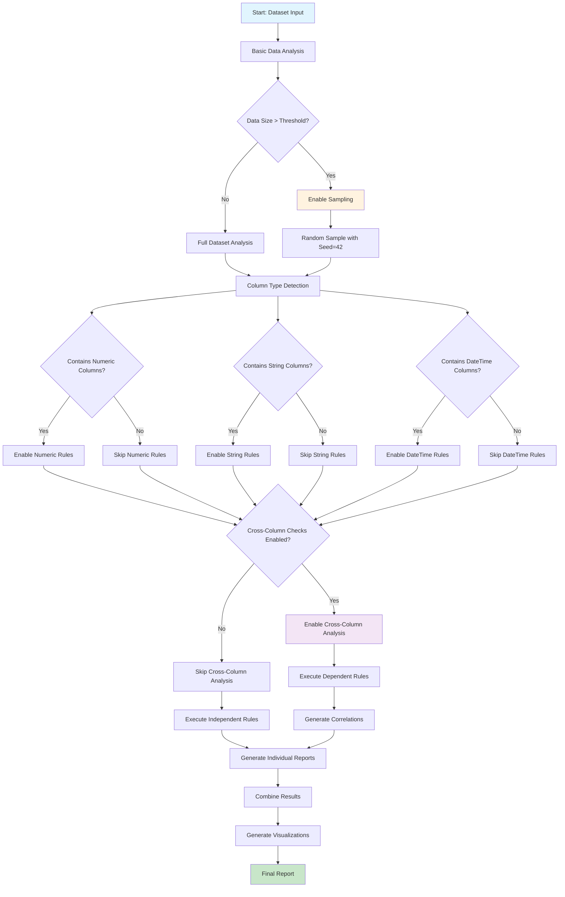

# Rule Dependency Decision Tree

This document contains the decision tree for rule dependencies in the Vebo Python code generation system. This tree will be updated throughout the project as new rules and dependencies are discovered.

## Decision Tree Flow

## Decision Points Explained

### 1. Data Size Threshold
- **Threshold**: TBD (e.g., 100,000 rows)
- **Decision**: If dataset exceeds threshold, enable sampling
- **Action**: Use random sampling with constant seed for reproducibility

### 2. Column Type Detection
- **Numeric Columns**: Enable statistical analysis, distribution checks, outlier detection
- **String Columns**: Enable pattern matching, length analysis, encoding checks
- **DateTime Columns**: Enable temporal analysis, date range validation, format checks

### 3. Cross-Column Analysis
- **Enabled**: Run correlation analysis, dependency checks, relationship validation
- **Disabled**: Skip cross-column rules for faster execution

### 4. Rule Dependencies
- **Independent Rules**: Can run in parallel
- **Dependent Rules**: Must wait for prerequisite rules to complete

## Rule Categories

### Basic Level (Always Run)
- Data type detection
- Null value analysis
- Basic statistics (count, unique values)
- File size and structure validation

### Standard Level (Data-Dependent)
- Distribution analysis (for numeric columns)
- Pattern analysis (for string columns)
- Date format validation (for datetime columns)
- Data quality metrics

### Deep Level (Cross-Column)
- Correlation analysis
- Relationship validation
- Complex data quality rules
- Advanced statistical tests

## Implementation Notes

- All random operations use seed=42 for reproducibility
- Parallel execution at both rule-level and category-level
- Error handling: skip failed rules, continue with remaining rules
- Results combined into structured JSON output
- Visualizations generated for key insights

## Updates Log

- **2024-12-XX**: Initial decision tree created
- **Future updates**: Will be added as new rules and dependencies are discovered
